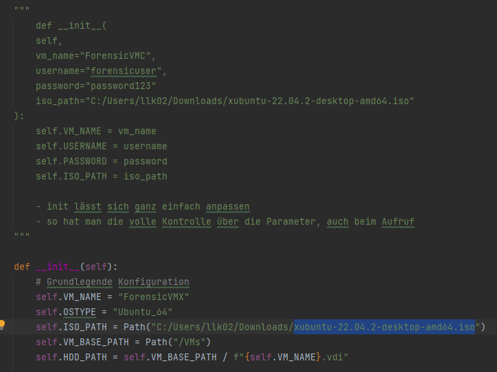
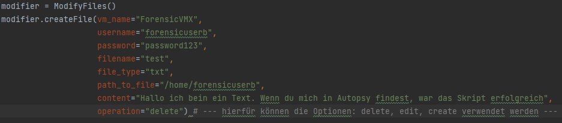
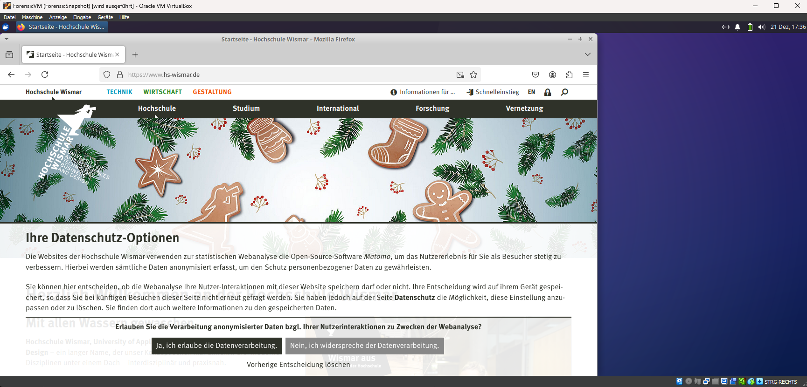

# Foresische Datenanalyse WS2024

- vorab wichtig:
- die **getVM_IP.py, smalltest.py und smallTest2.py** zeigen Beispiele, wie die implementierten Funktionen verwendet werden können, um ein Image automatisiert zu erzeugen

**Ziel:** 
- Erstellung eines Cases (forensischer Vorfall) und anschließende Automatisierung dieses Cases um eine Reproduzierbarkeit zu gewährleisten
- hier wird Python und VBoxManage verwendet um die Erstellung zu automatisieren

**Vorliegender Vorfall**:
- Zwei virtuelle Maschinen
- auf einer VM ist eine Datenbank installiert (PostgreSQL oder MySQL)
- in dieser Datenbank liegen PseudoDaten (im Fall von MySQL, das Mitarbeiterbeispiel)
- die zweite Maschine greift nun über das Netzwerk auf die Datenbank zu
- löscht zum Beispiel eine der Tabellen
- **Frage:** ist dieser Vorfall in Analyse-Tools wie Autopsy nachweisbar?

**Alternativer Vorfall:**
- dient der Reduzierung des Arbeitsaufwandes
- sollte einfacher nachweisbar sein
- wurde am 19.12.2024 im Meeting besprochen
- erstellen, beschreiben und Löschen von einfachen Dateien

## Umsetzung
- wir brauchen zwei Virtuelle Maschinen, welche Internetzuriff haben und im gleichen Netzwerk liegen
- außerdem soll der Host-PC mit den Maschinen interagieren können
- dieses Kriterium wird durch ein NAT-Netzwerk erfüllt

**Verwendete Software:**

1. VirtualBox (Version 7.0.6 r155176 (Qt5.15.2))
2. VBoxManage.exe (Version 7.0.6r155176)
3. VBoxGuestAdditions.iso (Version unbekannt, iso ist aber beigefügt)
4. Beliebige Ubuntu Distribution (möglichst eine, bei der ein Unattended Install möglich ist. Die reine Ubuntu Version geht möglicherweise nicht. Hier wurde Xubuntu verwendet (**xubuntu-22.04.2-desktop-amd64.iso**), welche ebenfalls der Doku beigefügt ist)
5. zwei Websites, diese beinhalten die Scancodes für die **run_firefox_and_input_scancodes()**, siehe **installCustomPackage.py**

https://kbdlayout.info/kbdgr/scancodes

https://aeb.win.tue.nl/linux/kbd/scancodes-1.html

 - Taste Drücken ist der Scancode
 - Taste Loslassen ist die Hex-Zahl in Dezimal +128 und zurück in Hex umgerechnet

6. bei Bedarf FTK-Imager

 ## vboxAutomation
 - ist das von mir entwickelte Python Package, welches bei der Erzeugung von virtuellen Maschinen helfen kann
 - bietet einen Funktionsatz zur Erstellung von Virtuellen Maschinen und deren Modeifizierung
 - auf diese Weise lassen sich identische Images erstellen, um für Lehrzwecke forensische Analysen durchzuführen
- im Ordner befinden sich mehrere Skripte, die ausgeführt werden können um das vorgestellte Szenario zu erstellen

### createVM.py
- ist das Basis-Skript zur Erstellung einer virtuellen Maschine mit VBox
- ist eine Klasse, welche initialisiert werden muss, um die Member der Klasse aufzurufen

- mit diesen Zeilen wird die Basis-Installation gestartet (vorher natürrlich importieren)

- hier die gewünschten Funktionen installieren
- die Klasse wird mit festen Parametern aufgerufen, die ist jedoch beliebig änderbar
- die Initialisierung der Klasse erfolgt dann mit den entsprechenden Parametern

- hier müsste der obere Block auskommentiert werden
- alle Parameter die überschrieben werden sollen, können dann im Funktionkopfhinzugefügt werden
- die alte \__init\__ müsste dann natürlich entfernt werden
- ansonsten auch beliebig die Parameter direkt Hardcoden
- ansonsten wir in diesem Skript der unbeaufsichtigte Install mit VBox vorbereitet
- der Nutzer muss sich also nicht durch Sprachauswahl oder andere Konfigurationen klicken
- der Installationsprozess ist komplett anpassbar und vollautomatisch
- an sich sind alle Funktionen selbsterklärend
- außerdem wird hier auch der Netzwerktyp festgelegt
- sollte das Nat-Netzwerk nicht existieren, wird dieses auch hierdurch erstellt
- der erstellte VM wird dann diesem Netzwerk zugewiesen
- standartmäßig wählt VBox ansonsten NAT als Netzwerkadapter

### getVM_IP.py
- ist nicht Teil des Packages
- ist ein von mir geschriebenes Beispiel
- ist speziell auf das Case zugeschnitten
- durch das vorherige Installationsskript befindet sich die VM jetzt im ForensicNetwork (ist in der **createVm.py** Hardgecoded), dabei handelt es sich um ein NAT-Network
- das Skript wartet mit der **wait_for_vm_ip()** auf die Installation der VM

- nach 15 Minuten würde das Skript die weitere Installation stoppen
- dauert je nach Rechner unterschiedlich lange und kann hochgesetzt werden

### configureNetwork_Port_Forwarding.py
- legt eine Port Forwarding Regel für die gerade erstellte VM an
- legt ein Port Forwarding für den Port 22 an
- für einige Skripte ist nämlich ein SSH-Zugriff notwendig (installMySql.py)
- legt ab Port 10000 neue Regeln an
- ein Problem kann sein, dass im ForensicNetwork IP-Adressen mehrfach vergeben werden
- VBoxManage erlaubt kein statisches Zuweisen von Adressen
- man müsste:
1. Port Forwarding festlegen für die IP vom DHCP Server
2. SSH installieren
3. über SSH eine statische IP zuweisen
4. Maschine neustarten
5. alte Port-Forwarding Regel löschen
6. neue Port-Forwarding Regel für die neue statische IP-Anlegen
- bisher ist das nicht so Implementiert!!!
- es wird darauf gehofft, dass eine IP nicht mehrfach zugewiesen wird
- dies ist dann der Fall, wenn andere Maschinen im Netz ausgeschaltet sind
- ist bisher nur einmal passiert, aber möglich
- Lösung sind die 6 Schritte

### optimized_installSSH.py
- VirtualBox bietet die Möglichkeit, direkt Befehle auf der VM auszuführen
- dies machen wir uns zunutze, um SSH zu installieren

- hier eine Reihe von Befehlen die ausgeführt werden sollen
- installiert SSH, erlaubt die Weiterleitung über Port 22
- aktiviert den SSH-Service
- die run_commands Funktion führt mit **subprocess.run** den Befehl aus
- die Befehle dort sind beliebig anpassbar, benötigen jedoch meistens SUDO-Rechte uf der VM
- die **run_commands** Funktion taucht immer wieder im Package auf, ist für zukünftige Versionen auslagerbar
- diese führt die Befehle aus und fügt den Pfad zur VBoxManage.exe hinzu
- diese Version derFunktion führt eine Liste von Befehlen aus
- **_run_commands** führt einen einzelnen Befehl oder einen zusammengeführten Befehlsblock aus
- nachdem SSH installiert wurde laufen andere Skripte und ein voller Zugriff ist auf die VM möglich

### installMySql.py
- installiert MySQL via ssh auf die VM
- alle der Funktionen, die via SSH etwas an der VM modifizieren, setzen vorraus, dass es für die entsprechende VM eine Port Forwarding Regel gibt
- es müssen also **configureNetwork_Port_Forwarding.py**, **optimized_installSSH.py**, **installMySQL.py** in dieser Reihenfolge ausgeführt werden, sodass eine Installation über SSH möglich ist !!!
- dies ist natürlich anpassbar, erfordert aber, dass die IP der VM mit übergeben wird
- erfodert außerdem einen anderen Netzwerktyp

### sampleDataMySQL.py
- klont ein Git-Repository
- lädt Daten in eine MySQL-Datenbank
- der zugriff erfolgt über SSH

### installPostgreSql.py
- viel flexibler als die **installMySql.py** ist jedoch die Postgres-Installation
- hier wird Postgres nur mithilfe von VBoxManage Befehlen installiert
- diese Funktion ist jedoch relativ komplex und hat mehrere mögliche Aufrufe
- diese sind im Kommentarblock oben im jeweiligem Skript zu finden
- installiert Postgres und erlaubt die Modifikation der Zugriffsberechtigungen
- kann auf beliebige virtuelle Maschinen angewendet werden
- nach diesem Schema könnten viele Funktionen erstellt werden

### installCustomPackage.py
- erlaubt den höchsten Freiheitsgrad
- erlaubt das Installieren einzelner Pakete 

        installPackage(
            vm_name="ForensicVM",
            username="forensicuser",
            password="password123",
            package="tilix"
        )

- für komplexere Installationen gibt es eine weitere Funktion
- diese erlaubt das direkte Ausführen beliebig vieler Befehle hintereinander auf der VM
- funktioniert ebenfalls ohne vorherige Netzwerkkonfiguration

        executeCommand(
            vm_name="ForensicVM",
            username="forensicuser",
            password="password123",
            user_commands=["wget https://dl.google.com/linux/direct/google-chrome-stable_current_amd64.deb",
                        "dpkg -i google-chrome-stable_current_amd64.deb"]
        )

- hier eine Kette von Befehlen zur Installation von Chrome
- ebenfalls in dieser Datei enthalten gibt es eine experimentelle Funtkion
- **run_firefox_and_input_scancodes()**
- erlaubt das ausführen von Tastenbefehlen
- ist ein beliebig anpassbares Konzept
- wird mit **suprocess.Popen()** ausgeführt
- ermöglicht das ausführen eines Prozesses ohne auf dessen Ausgabe warten zu müssen

        command = (
            f'"{path}" guestcontrol {vm_name} run --exe "/snap/bin/firefox" '
            f'--username {username} --password {password} --putenv "DISPLAY=:0"'
        )

- starten einer Anwendung, hier ist es Firefox
- dafür den Pfad kennen !
- funktioniert natürlich erstmal nur für Firefox
- die Funktion **run_firefox_and_input_scancodes()** ermöglich das Öffnen von Firefox
- anschließende werden Scancodes (siehe die beiden obigen Links) an die VM gesendet

        # Focus auf das Firefox-Fenster mit Alt+Tab (d.h. Alt drücken, dann Tab drücken)
        logger.info("Fokussiere das Firefox-Fenster mit Alt+Tab...")
        subprocess.run(f'"{path}" controlvm {vm_name} keyboardputscancode 38', shell=True)  # Alt drücken
        subprocess.run(f'"{path}" controlvm {vm_name} keyboardputscancode 0F', shell=True)  # Tab drücken
        time.sleep(0.1)

        # Loslassen der Tasten (Alt und Tab)
        subprocess.run(f'"{path}" controlvm {vm_name} keyboardputscancode 8F', shell=True)  # Tab loslassen
        subprocess.run(f'"{path}" controlvm {vm_name} keyboardputscancode B8', shell=True)  # Alt loslassen
        time.sleep(0.1)

        # bis hier funktioniert das alles
        # ab der nächsten Zeile bisher nicht

        # Füge Scancodes für die Adressleiste ein (z.B. Ctrl+L)
        logger.info("Füge Tastenkombination für Adressleiste ein...")
        subprocess.run(f'"{path}" controlvm {vm_name} keyboardputscancode 1D', shell=True)  # Ctrl drücken
        subprocess.run(f'"{path}" controlvm {vm_name} keyboardputscancode 26', shell=True)  # L drücken
        time.sleep(0.1)

        # Lässt die Tasten los
        subprocess.run(f'"{path}" controlvm {vm_name} keyboardputscancode A6', shell=True)  # L loslassen
        subprocess.run(f'"{path}" controlvm {vm_name} keyboardputscancode 9D', shell=True)  # Ctrl loslassen
        time.sleep(1)

        # Scancodes für den Text "Hallo" eingeben
        logger.info("Füge Scancodes für Text ein...")
        for code in scancodes:
            logger.info(f"Sende Scancode: {code}")
            subprocess.run(f'"{path}" controlvm {vm_name} keyboardputscancode {code}', shell=True)
            time.sleep(0.1)  # Kurze Pause zwischen den Tastendrücken

- simuliert das Fokussieren des Fensters druch Drücken von ALt+Tab
- simuliert das Drücken von Ctrl+L (in die Adressleiste schreiben)

- schreibe die Scancodes mittels Schleife in dei Adresszeile
- ganz wichtig: auch das Loslassen muss ausgeführt werden, sonst bleiben die Tasten quasi ewig gedrückt
- Funktionsaufruf: 

        scancodes = [
            "23",  # h drücken
            "A3",  # h loslassen
            "17",  # i drücken
            "97"   # i loslassen
        ]

        run_firefox_and_input_scancodes(vm_name="ForensicVM", username="forensicuser", password="password123",scancodes=scancodes)

## Erweiterungsmöglichkeiten
1. Funktionen auslagern um Redundanz zu vermeiden (**run_commands**), hierfür muss eine Art Sub-Package erstellt werden
2. **\_\_init\_\_** in der **createVM.py** anpassen (So Konfiguration der VM mittels Initialisierung der Klasse)
3. mehr Funktionalitäten hinzufügen (je nachdem welches Case man umsetzen möchte, durchaus aufwendig bei großen Cases)
4. Hinzufügen von Funktionen, die konkret forensische Spuren hinterlassen (löschen von Daten, vielleicht sogar die zunächst geplante SQL-Injektion)
5. Möglichkeit, das ganze mithilfe einer JSON oder anderen Dateiformaten auszuführen (also einfach eine Config schreiben und die Bibliothek übernimmt den Rest)
- eine Implementierung einer Dateien löschen, erstellen, schreiben... Funktion folgt hier:

## Erweiterung: Dateien erstellen, löschen, bearbeiten
- wie gewohnt den Funktionssatz erweitern
- neue Datei im **vBoxAutomation** Ordner erstellen
- **modifyFiles.py**
- in der **\_\_init\_\_** dann einfach die Datei, die Klasse oder die gewünschte Funktion hinzufügen
- ist eine ganz simple Funktion, die einfach altbekannte Befehle an die VM sendet
- falls es gewünscht ist, kann das Ganze natürlich auch mit Scancodes gesteuert werden, sodass live beobachtet werden kann was passiert
- der Ansatz für diese Variante ist im Kommentar der Funktion **createFile** zu finden

## Export der Images
- kann entweder via Skript erfolgen oder via Befehl im Terminal
- mein Vorschlag ist der Terminal Befehl

        VBoxManage clonehd absolutepath/image.vdi image.img --format raw

- Pfad zu VBoxManage und Pfad zur VDI angeben
- gibt ein RAW Image Format
- dieses RAW Image dann einfach im FTK Imager in ein e01 umwandeln 
- Analyse kann dann zum Beispiel mit Autopsy erfolgen

- ich kann leider bisher nicht bestätigen, ob gelöschte Dateien wieder auffindbar sind
- die Indizierung mit Autopsy läuft bereits mehrere Stunden, weswegen eine Suche nach Dateinamen aktuell nicht möglich ist
- jedoch muss angemerkt werden, dass die Bibliothek wunderbar für das erstellen von Images funktioniert
- nur das Legen von forensischen Spuren ist ausbaufähig

## Ergebnisse
- aktuell warte ich noch auf die Indizierung aber:
- einige interessante sachen konnte ich dennoch finden
- wenn wir uns die **.bash_history** ansehen, dann fällt auf, dass nur Befehle zu sehen sind, die ich wirklich selber im Terminal ausgeführt habe

- Befehle die mithilfe von VBoxManage ausgeführt wurden sind hier nicht aufgeführt!
- das ist eine wichtige Erkenntnis
- wir können also Images erstellen ohne Spuren bei der Installation zu hinterlassen
- das ist in manchen Use Cases sehr hilfreich
- falls wir konkrete Spuren legen wollen, folgen weitere Tests, indem wir Keyboardcodes einzeln an die VM senden
- weiterhin interessant: 
- syslog

- hier zu sehen ist der Syslog von PostgreSQL
- offenbar gab es hier einen Neustart, den wir angekurbelt haben, nachdem der Zugriff auf lokale Zugriffe eingeschränkt wurde !!!

- also noch ein Versuch mit Scancodes. Da es diesmal kompliziert wird, mit Programm zum Übersetzen und Umrechnen von Scancodes + das Loslassen ausrechnen
- claude.ai war so nett mit bei der Erstellung des Skriptes behilflich zu sein 
- mit dummer Benennung **smallTest3.py**
- Ausgabe des Skriptes, https://www.hs-wismar.de/ wird zu:

- wemm wir jetzt die altbekannte Firefox Funktion aufrufen, tun wir das mit einer aktualisierten Liste von Hex Zahlen, wie im obigen Bild zu sehen ist

- und tatsächlich schaffen wir es dadurch die Seite der Hochschule im Browser aufzurufen
- das bedeutet jetzt für unsere Dateien ändern Funktion:
- wir senden anstelle von Strings,  Hexcodes und rufen ein Terminal auf, anstelle von Firefox
- die Befehle dann als Hexcodes übergeben